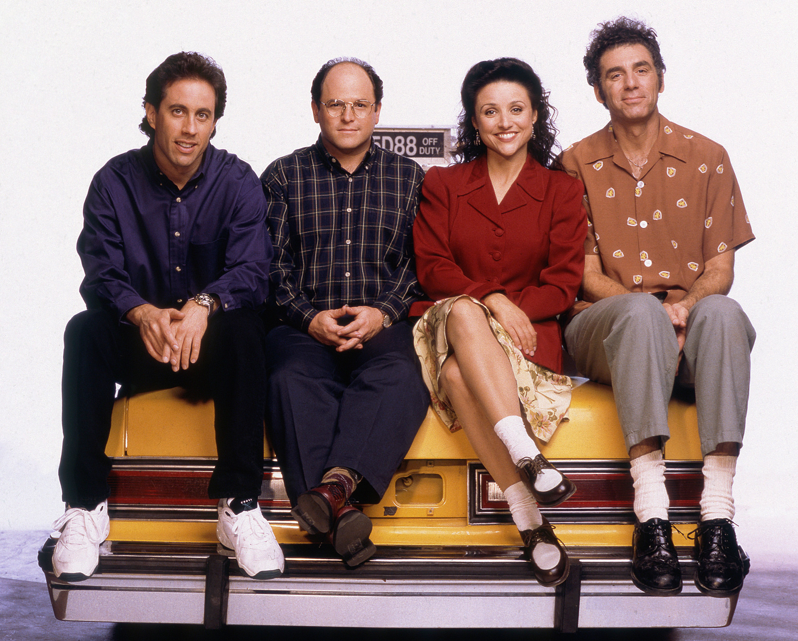

# Seinfeld-script-generator-RNN
Part of Udacity deep learning nanodegree: RNN using Pytorch that generate Seinfeld scripts

## Project Description
Using a dataset of scripts from Seinfeld 9 seasons, we'll build a neural network using RNN (recurrent neural network) to generate "fake" Seinfeld scripts

The RNN is created in Python in a Jupyter notebook using Pytorch and trained on GPU.
After the dataset is pre-proccessed and tokenized, the RNN is built with hidden, embedding and LSTM layer. 
The network is ran with forward and backpropagation and trained for 20 epochs. 
The hyper-parameters used are in the code.

## Results after training for 20 epochs generating 200 words and starting from the word "Jerry"

jerry:... i think i should be able to be able to get some water in the city.

kramer: hey, i don't know.

kramer: i don't understand. you have to get the same way you have, but i don't know how you could get the same way.

jerry: oh, i don't want to get a message to this.

jerry: i don't know.

george: what do you think?!

george:(sarcastic) yeah!

george: oh, no.

jerry: what do you think?

elaine: i don't know.

jerry: i can't believe it. i think you're a little nervous.

george: well i don't have to see you.

george: i know i was just a very serious guy, and i can't get a little more.(to jerry) i can't believe you don't have to be in the hospital.

george: well, i don't have to see it anymore.

elaine: oh,

